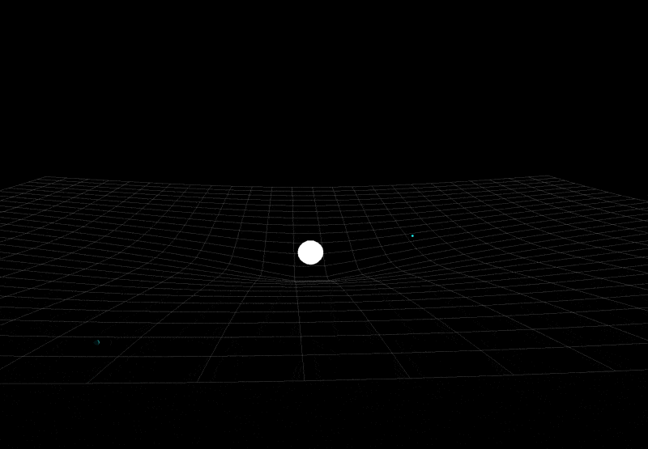

# Gravity Simulator



A 3D gravity simulation that visualizes n-body interactions using OpenGL, GLFW, GLAD, and GLM.

## Prerequisites

- CMake 3.20+
- A C++17-compatible compiler (clang or gcc)
- GLFW
- GLM
- GLAD headers (included in `dependencies/`)

### macOS (Homebrew)

```bash
brew install cmake glfw glm
```

### Ubuntu / Debian

```bash
sudo apt update
sudo apt install build-essential cmake libglfw3-dev libglm-dev
```

## Build & Run

1. Clone the repository and change into the project directory:
   ```bash
   git clone https://github.com/<your-user>/<your-repo>.git
   cd gravity
   ```
2. Configure the project with CMake:
   ```bash
   cmake -B build
   ```
3. Build the executable:
   ```bash
   cmake --build build
   ```
4. Run the simulator:
   ```bash
   ./build/gravitysimul
   ```

## Development Workflow

- Source files live in `src/`
- External headers are in `dependencies/`
- Adjust simulation parameters in `src/finalgravitysim.cpp`
- Modify rendering constants in `src/config.h`

## Controls

- `W/A/S/D` : Move camera horizontally
- `Space` / `Shift` : Move camera up / down
- Mouse look : Rotate the camera
- `Esc` or `K` : Pause / resume the simulation
- `+ / -` : Speed up / slow down time
- Mouse left-click : Spawn a new object (drag to position before release)
- Mouse right-click (hold) : Increase mass of the newest object

## License

MIT License © 2025
